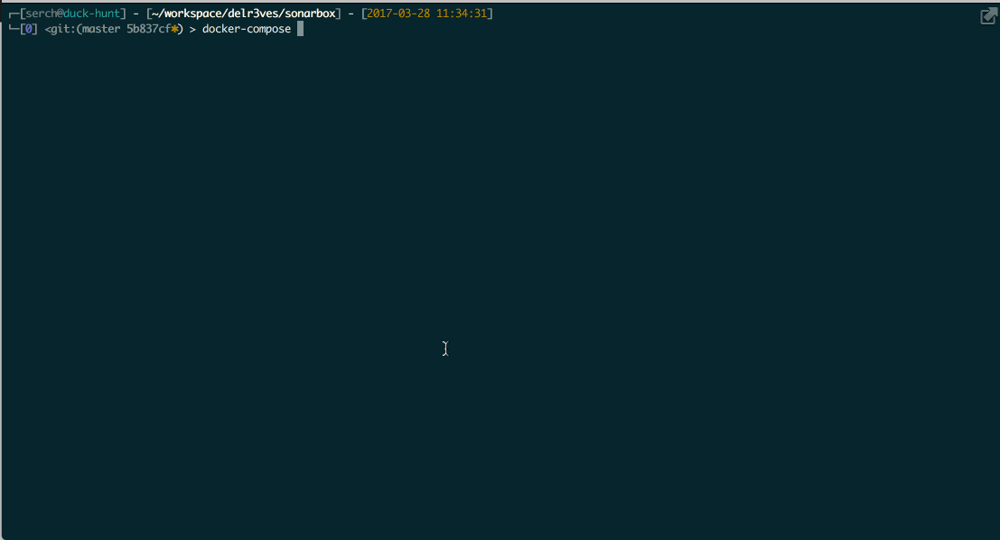

# SonarBox
Provides a docker infrastructure to execute Sonar without changing any configuration of the project

## What is it?

SonarBox is only a docker infrastructure to analyze our projects in a non-invasive and effortless way. It provides the SonarQube server, a persistent Database for our analysis and a scanner to perform the analysis.

## Prerequisites
The only thing you need to perform the analysis is [docker]https://www.docker.com) and [docker-compose](https://docs.docker.com/compose/)

## Configuration
Until I upload the scanner to docker registry, you'll need to build the scanner image the first time you run the project. Doing it, is as simple as Running

    $ docker-compose build

You'll get a standard SonarQube installation. However you'll possibly want to configure it and add install some plugins before performing the analysis.
The only thing you need to do is starting the server by executing:

    $ docker-compose up sonar

If you want to install pluigns just follow this instructions:

1. Once the server is running you can open [http://localhost:9000](http://localhost:9000) and log into Sonar with **admin/admin** credentials.
2. Then navigate to Administration
3. Go to System > Update Center
4. In available tab you'll find every plugin you need.

**The plugins will be stored into sonar-extensions folder so you'll only need to do this the first time.**

## How to analyze a project?

Before analyzing the project you'll have to create a sonar-project.properties file for your project type. You'll find some examples in the [templates](templates) folder.

### Creating your own sonar-project.properites
TBD

### Running the analysis
Once you have your configuration file, analyzing the source should be as simple as

    $ export PROJECT_TO_ANALIZE=/path/to/your/source/code
    $ export SONAR_PROJECT_PROPERITES=/path/to/your/project/properies/file
    $ docker-compose up scanner

